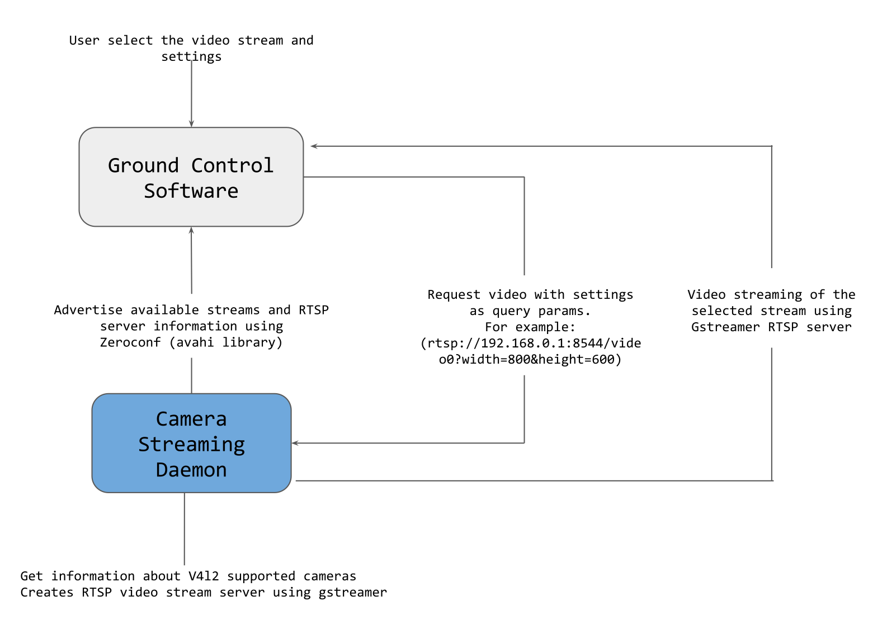

# Basic Flow of Camera Streaming Daemon



## Video Discovery

Camera Streaming Daemon scans the system devices looking for V4l2 devices to be added to the internal stream list. V4l2 API is used to retrieve extra information about the videos, such as resolution and supported formats.
The Daemon can be extended to support custom video streams that are not supported by V4l. Information about that is documented at [Extending CSD](../guide/extending_csd.md). All custom videos are also added to the internal video stream list.

## Video Advertisement

Zeroconf (http://www.zeroconf.org/) is the protocol used to advertise the available video as long as information about them. Using the Avahi(https://avahi.org/) implementation of the Zeroconf protocol we publish all video streams as _rtsp services with path, ip and port necessary to access the resource. Extra information about video is published using txt-record field from the avahi resource.
It is possible to use the application avahi-browse to retrieve the information published by the Camera Streaming Daemon. A basic output of the command is the following:

```
$ avahi-browse -arl
+ wlp58s0 IPv4 /video0                                       _rtsp._udp           local
+ wlp58s0 IPv4 /video1                                       _rtsp._udp           local
= wlp58s0 IPv4 /video0                                       _rtsp._udp           local
   hostname = [hostname.local]
   address = [192.168.1.1]
   port = [8554]
   txt = ["name=Integrated_Webcam_HD" "frame_size[0]=YUYV(640x480,160x120,320x180,320x240,424x240,640x360,640x480)" "frame_size[1]=MJPG(848x480,960x540,1280x720)"]
= wlp58s0 IPv4 /video1                                       _rtsp._udp           local
    hostname = [hostname.local]
    address = [192.168.1.1]
    port = [8554]
    txt = ["name=USB_Camera_1" "frame_size[0]=YUYV(640x480,160x120,320x180,320x240,424x240,640x360,640x480)"]
```


## Video Streaming

Camera Streaming Daemon is using GStreamer RTSP servers to handle video streaming and the resources are accessed using a rtsp URI created using the information from zeroconf output.

The base URI to access video streams is:
```
rtsp://ADDRESS:PORT/VIDEO_STREAM_ID[?option1=value1&option2=value2...]
```

Where:
- ADDRESS is the hostname or IP of the remote server, informed in zeroconf IP field.
- PORT is the port of the RTPS server, informed in zeroconf port field
- VIDEO_STREAM_ID is the name of the video stream, informed in zeroconf name field 

The supported optional parameters option1, option2,...,optionN, as long as its values are any from:
- height, The height of the video stream
- width, The width of the video stream

For example all following requests are supported for the videos published in the previous section:
- rtsp://192.168.1.1:8554/video0
  - Play video0 stream using default configuration.
- rtsp://192.168.1.1:8554/video1?format=YUYV&width=640&height=480
  - Play video1 stream using YUYV format and resolution 640x480
- rtsp://192.168.1.1:8554/video1?format=YUYV&width=800&height=600
  - Play video1 stream using default configuration because 800x600 resolution is not available for format YUYV.