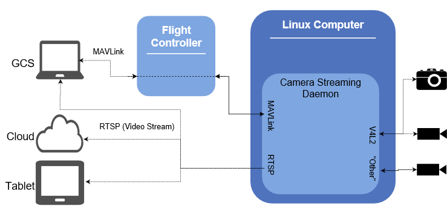

## Overview

The diagram below shows the main components of a "typical" system that is running the *Camera Streaming Daemon* on a Linux companion computer.
CSD connects to multiple cameras that are attached to the linux computer. 
It provides access to them via the [MAVLink Camera Protocol](https://mavlink.io/en/protocol/camera.html) and RTSP video streams. It can also advertise available RTSP streams using Avahi. 

In the diagram above the GCS requests for camera actions are forwarded by PX4 - CSD can also take MAVLink requests directly, and may do so in different configurations.

## Key Features

CSD supports the following key features:

* Automatically attaches [compatible cameras](#supported_cameras) connected to the Linux computer.
* RTSP video streaming from *all* connected cameras (for consumption by GCS or other video players).
* RTSP video stream advertising/discovery using Avahi.
* [MAVLink Camera Protocol](#mavlink_support) support for up to 5 cameras, enabling video and image capture and storage, and querying/setting camera options.
* Gazebo simulated camera backend (so you can view video streams from within a simulated environment)!
* Configurable back-end that can be extended to interface with new types of cameras and new front-end protocols.

## Supported Cameras {#supported_cameras}

Cameras that support the [Video4Linux (V4L2) API](https://linuxtv.org/downloads/v4l-dvb-apis/uapi/v4l/v4l2.html) should work out of the box. 
The server can be [extended](../guide/extending_csd.md) to support other back-end camera protocols/APIs.

Some readily-available cameras that have been used in testing include: 
* Logitech C270 HD Webcam
* Sony PlayStation Eye Camera
* Intel RealSense 3D Camera

## Configuration Options {#configuration}

Compile-time configuration is provided through [build-configuration flags](../getting_started/building_installation.md#configure). These allow developers to enable support for: MAVLink, RTSP stream discovery using Avahi, RealSense Camera, Intel Aero bottom camera and Gazebo. RTSP streaming is always enabled.

Run-time configuration is provided by the [CSD Configuration File](../guide/configuration_file.md). Among other things, this allows users to set where captured images will be stored, devices that will not be connected, and settings required for defining the MAVLink node.

Advanced configuration information about individual cameras is specified in [Camera Definition Files](TBD). While not strictly part of CSD, these files are referenced in the [CSD Configuration File](../guide/configuration_file.md#uri) and may need to be served on the same computer as CSD.

## MAVLink Camera Protocol Implementation {#mavlink_support}

CSD implements the full [MAVLink Camera Protocol](https://mavlink.io/en/protocol/camera.html) (March 2018), including support for image and video capture, and getting/setting camera parameters and options. 

The MAVLink properties of CSD are specified in the *CSD Configuration File*:
* The [\[mavlink\]](../guide/configuration_file.md#mavlink) section is used to specify the MAVLink destination UDP port, the broadcast address for heartbeat messages, and the system id (which should be set to match the autopilot).
* The [\[uri\]](../guide/configuration_file.md#uri) section specifies the device to URI mapping for [Camera Definition Files](TBD).

Component IDs for each camera are allocated automatically and sequentially from [MAV_COMP_ID_CAMERA2](https://mavlink.io/en/messages/common.html#MAV_COMP_ID_CAMERA2) to [MAV_COMP_ID_CAMERA6](https://mavlink.io/en/messages/common.html#MAV_COMP_ID_CAMERA6) (inclusive) as cameras are connected (once all component ids are allocated further cameras are not addressable).

**Limitations:**

* At time of writing (March 2018) the camera protocol, and hence CSD, do not yet include a formal specification for managing or advertising RTSP video streams.
* The MAVLink protocol supports up to 6 cameras in a single system (only 6 `component_id` values are defined). Currently only 5 cameras can be accessed via CSD (see [#142](https://github.com/intel/camera-streaming-daemon/issues/142)).
