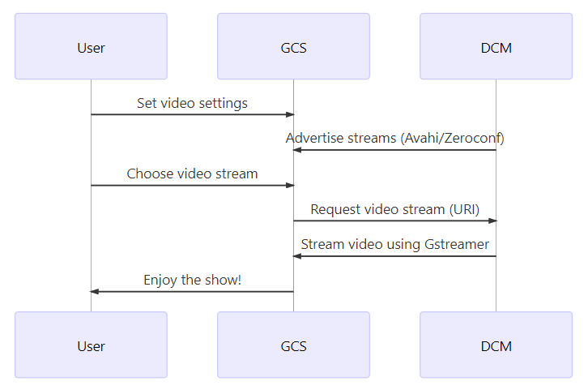

# RTSP Streaming & Discovery

## RTSP Usage Flow

The diagram below shows the common sequence for advertising and accessing RTSP video streams.

<!-- generate in https://mermaidjs.github.io/mermaid-live-editor
{/% mermaid %}
sequenceDiagram;
    participant User
    participant GCS
    participant DCM
    User->>GCS: Set video settings
    DCM->> GCS: Advertise streams (Avahi/Zeroconf)
    User->>GCS: Choose video stream
    GCS->>DCM: Request video stream (URI)
    DCM->>GCS: Stream video using Gstreamer
    GCS->>User: Enjoy the show!
{/% endmermaid %}
-->



## Video Advertising (Avahi)

> **Tip** In order to use this service DCM must be built with [Avahi enabled](../getting_started/building_installation.md#configure). 

The [Avahi](https://avahi.org/) implementation of the [Zeroconf](http://www.zeroconf.org/) protocol is used to advertise available video streams. All streams are published as RTPS services with path, ip and port necessary to access the resource. Extra information about video is published using `txt-record` field from the Avahi resource.

It is possible to use the application `avahi-browse` to retrieve the information published by the Camera Manager. A basic output of the command is the following:

```
$ avahi-browse -arl
+ wlp58s0 IPv4 /video0                                       _rtsp._udp           local
+ wlp58s0 IPv4 /video1                                       _rtsp._udp           local
= wlp58s0 IPv4 /video0                                       _rtsp._udp           local
   hostname = [hostname.local]
   address = [192.168.1.1]
   port = [8554]
   txt = ["name=Integrated_Webcam_HD" "frame_size[0]=YUYV(640x480,160x120,320x180,320x240,424x240,640x360,640x480)" "frame_size[1]=MJPG(848x480,960x540,1280x720)"]
= wlp58s0 IPv4 /video1                                       _rtsp._udp           local
    hostname = [hostname.local]
    address = [192.168.1.1]
    port = [8554]
    txt = ["name=USB_Camera_1" "frame_size[0]=YUYV(640x480,160x120,320x180,320x240,424x240,640x360,640x480)"]
```

> **Tip** See also [Manual Tests > List Available Streams with Avahi](../test/manual_tests.md#list-available-streams-with-avahi) for a similar example using `avahi-browse -r _rtsp._udp`.

## Video Streaming

The *Camera Manager* uses *GStreamer* RTSP servers to handle video streaming. The streams are accessed using a RTSP URI created using the information from *zeroconf* output.

The base URI to access video streams is:
```
rtsp://ADDRESS:PORT/VIDEO_STREAM_ID[?option1=value1&option2=value2...]
```

Where:
- `ADDRESS` is the hostname or IP of the remote server, informed in zeroconf IP field.
- `PORT` is the port of the RTSP server, informed in zeroconf port field.
- `VIDEO_STREAM_ID` is the name of the video stream, informed in zeroconf name field.

The supported optional parameters option1, option2,...,optionN, as long as its values are any from:
- `height` - The height of the video stream
- `width` - The width of the video stream

For example, all following requests are supported for the videos published in the previous section:

URI | Stream
--- | ---
rtsp://192.168.1.1:8554/video0 | Play video0 stream using default configuration.
rtsp://192.168.1.1:8554/video1?format=YUYV&width=640&height=480 | Play video1 stream using YUYV format and resolution 640x480 
rtsp://192.168.1.1:8554/video1?format=YUYV&width=800&height=600 | Play video1 stream using default configuration because 800x600 resolution is not available for format YUYV.